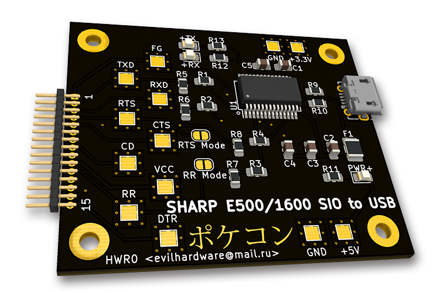
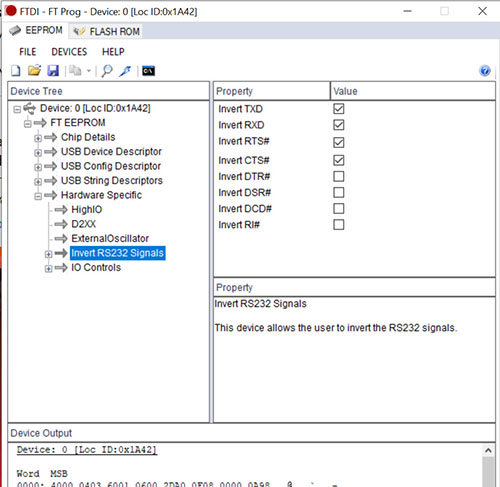

# SHARP PC-E500/E500S/PC-1600/PC-1600K 15pin USB to Serial Interface
USB to Serial (FT232RL based) Interface for the SHARP PC-E500 / E500S / PC-1600 / PC-1600K line of Pocket Computers 

## Important
NB 1: the 15pin adapter is a 1x15 pin 1.27mm (50mil) male connector 
NB 2: You have to bridge the right solderjumper (RR or RTS) depending on the mode you use for it to work. I have RTS bridged usually 

## Components

The USB-B-micro Receptacle in this schema is a Molex 105017-0001 / 105017-1001, every LED / R / L / C is 0805, FT232RL is a SSOP28, the Polyfuse is a 1210 PTC Resettable fuse, 500-700mA or similar

## After-Construction Configuration

As the Sharp Pocket computers use <b>inverted</b> Levels, you have to invert RXD, TXD, RTS# and CTS# on your FT232RL chip too.

You do this by downloading the program <b>FTProg</b> from the FTDI Site :  <a href="https://www.ftdichip.com/Support/Utilities.htm#FT_PROG">Here</a>.

You need also to configure CBUS0 as RXLED and CBUS1 as TXLED in order to gain LED Functionality.

<b> AND FOR HEAVEANS' SAKE:</b> Never set the FT chip to External OSC (Escpecially on this board where it does not have an External Oscillator) lest you are self-destructive and want to brick your chip !

-------------------------
