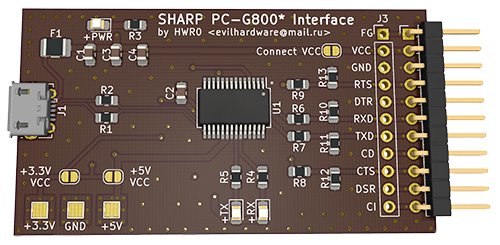

# PokeConSerial
Serial Interfaces for Pocket Computers (ポケコン) (Sharp, Casio, TRS80-M100,...)

- <a href="g850_kiss/">Sharp G800/G850/V/S/VS 11pin USB to Serial Interface</a>

- <a href="Sharp_11pin_to_15pin_Adapter/">Sharp 11pin to 15pin Adapter</a>
  (to use the Sharp G850* USB to Serial adapter with the Sharp PC-E500 and the Sharp PC-1600)

- Casio FA-7 compatible (for PB-1000, AI-1000, PB-2000C) USB Interface (soon, needs to be validated)
