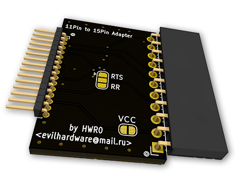

# SHARP 11pin to 15pin Adapter
Adapter to use with the <a href="https://github.com/hwreverse/PokeConSerial/tree/master/g850_kiss">Sharp G800* USB to Serial Interface</a>
to make it work for the SHARP PC-E500 and the Sharp PC-1600

NB 1: the 11pin adapter is a 1x11 pin 2.54mm (100mil) female connector, the 15pin adaptor is a 1x15pin 1.27mm (50mil) male connector

NB 2: You have to bridge the right solderjumper (RR or RTS) depending on the mode you use for it to work. I use RTS with both calculators

NB 3: Use VCC Connect if for some reason, you want to power the device from USB (use with *EXTREME* care!!)

