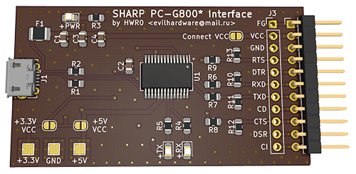
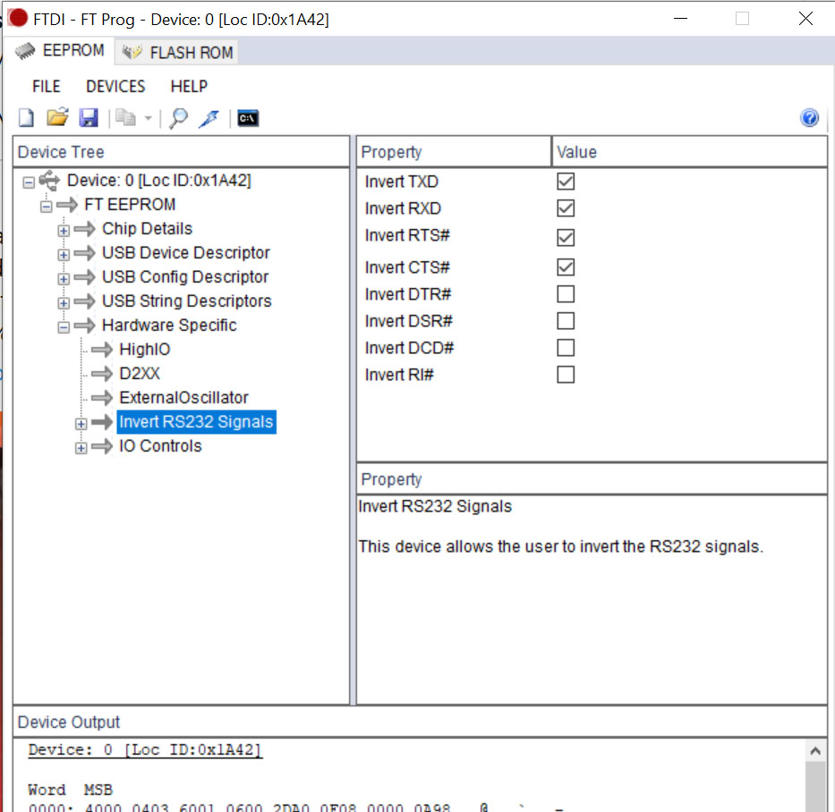

# SHARP PC-G800*/G850*/V/S/VS 11pin USB to Serial Interface
USB to Serial (FT232RL based) Interface for the SHARP G800* line of Pocket Computers (G811, G850, G850V, G850S, G850VS)

## Important
NB1: the 11pin adapter is a 1x11 pin 2.54mm (100mil) male connector 
NB2: Use VCC Connect if for some reason, you want to power the device from USB (use with *EXTREME* care!!) 
NB3: Bridge the 5V VCCIO Solder Jumper to work with the G850*, this sets the I/O Level to 5V 

## Components

The USB-B-micro Receptacle in this schema is a Molex 105017-0001, every diode / R / C is 0805, FT232RL is a SSOP28, the Polyfuse is a 1210 500mA or similar

## After-Construction Configuration

As the Sharp Pocket computers use <b>inverted</b> Levels, you have to invert RXD, TXD, RTS# and CTS# on your FT232RL chip too.

You do this by downloading the program <b>FTProg</b> from the FTDI Site :  <a href="https://www.ftdichip.com/Support/Utilities.htm#FT_PROG">Here</a>.

You need also to configure CBUS0 as RXLED and CBUS1 as TXLED in order to gain LED Functionality.

<b> AND FOR HEAVENS' SAKE:</b> Never set the FT chip to External OSC (Escpecially on this board where it does not have an External Oscillator) lest you are self-destructive and want to brick your chip !

-------------------------

